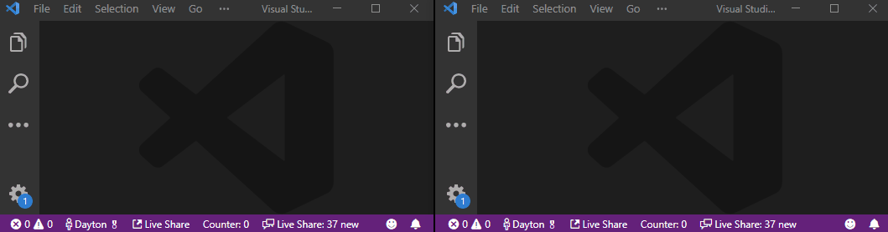

# Counter
This extension is a collaborative counter - when a guest joins a Live Share session, their counter will be synced with the host's, and any changes made by the host or guests are reflected for all participants.

# Building
`npm install`

`F5` from within VS Code